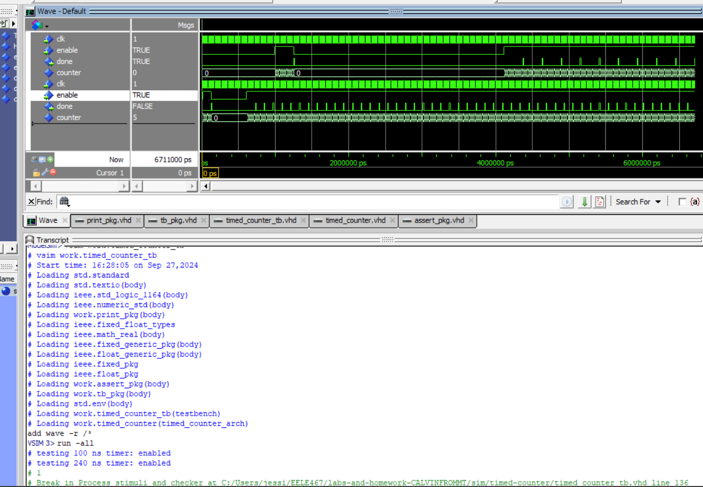

# Homework 4: Timed Counter VHDL
## Overview
In this homework a timed counter.  Its able to count for a specified time based on the period of the clock and the rising edge of the clock.  We made sure the counter did not complete any clocking when the timer was enabled.  

## Deliverables
