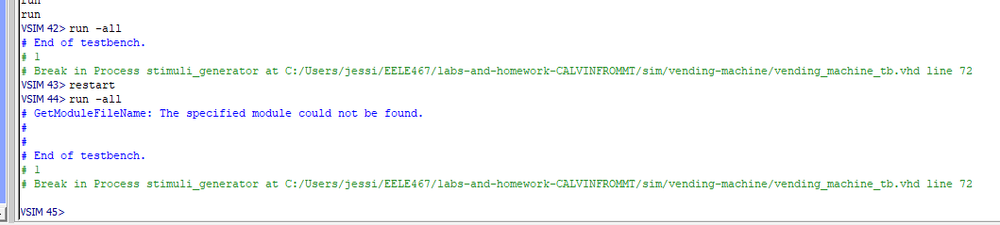

# Homework 5: Vending Machine VHDL
## Overview
In this homework we created a vending machine state machine. We were given the testbench and used the assert, print and tb pakages from homework 4.  

## Deliverables
