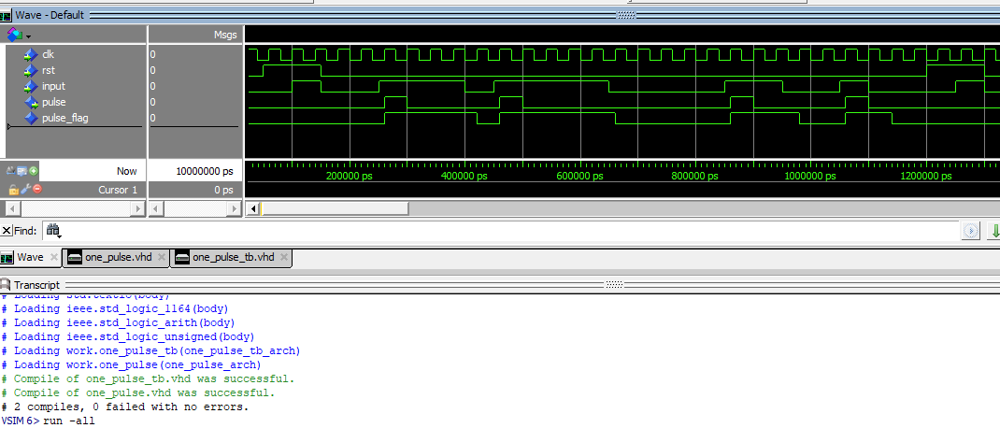
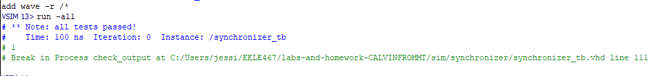

# Homework 6: Async Conditioner
## Overview
In this homework we cobine a sychronizer, debouncer and one pulse.  The sychronizer is schronizing the button push value with the internal clock.  The debouncer locks in the single button push. The one pulse will take the button press and make a pulse that lasts one system clock cycle. This assignment started with getting each component to work individually then combining them into one conditioner.    

## Deliverables
### Debounce

### One Pulse 

### Synchronizer
