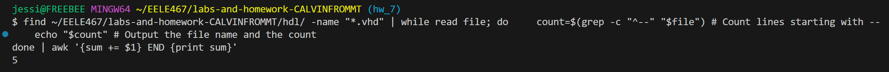

# Homework 7: Async Linux CLI Practice
## Overview
Practice Linux CLI tools and chaining multiple commands together.   

## Grade School Activities.
### Counting.
#### P1: 
 - $ wc -w lorem-ipsum.txt 
#### P2: 
 - $ wc -m lorem-ipsum.txt 
#### P3: 
 - $ wc -l lorem-ipsum.txt
   
  

### Sorting
#### P4: 
 - $ sort -h file-sizes.txt > human_numeric_sort.txt 
#### P5: 
 - $ sort -hr file-sizes.txt > r_human_numeric_sort.txt
   
  

### Cutting
#### P6: 
I started with cat log.csv to see the formatting of the file.  
Then I used $ cut -d ',' -f 3 log.csv. 

 

#### P7: 
 - $ cut -d ',' -f 2,3 log.csv
   
 

#### P8:
 - $ cut -d ',' -f 1,4 log.csv
   
 

### Heads or Tails
#### P9: 
 - $ head -n 3 gibberish.txt
   

#### P10:
 - $ tail -n 3 gibberish.txt
   
 

#### P11: 
 - $ tail -n +2 log.csv 
Used +2 because we want take the bottom of the file upto the 2nd line.
If we used +1 it would be the whole file.

### Searching for Patterns
#### P12: 
 - $ grep "and" gibberish.txt
   

#### P13:
 - $ grep -w -n "we" gibberish.txt

#### P14: 
 - $ grep -P -o -i "to \w+" gibberish.txt
   

#### P15:
 - $ grep -c "FPGAs" fpgas.txt
   

#### P16:
 - $ grep "are hot.$\|are not.$\|cower,$\|tower.$\|smile,$\|compile.$" fpgas.txt
   

#### P17:
 - find ~/EELE467/labs-and-homework-CALVINFROMMT/hdl/ -name "*.vhd" | while 
 read file; do 
 count=$(grep -c "^--" "$file") # Count lines starting with --  
 echo "$file:$count" # Output the file name and the count 
done

### Redirection
#### P18:
 - $ ls > ls-output.txt
   

### Composing Commands

#### P19:

<!-- [Picture of command and output used](assets/Hw7_ComposeA.png)) -->

#### P20:
 - $ find hdl/ -iname "*.vhd" | wc -l
   

#### P21:
 - find ~/EELE467/labs-and-homework-CALVINFROMMT/hdl/ -name "*.vhd" | while    read file; do     count=$(grep -c "^--" "$file") 
    echo "$count"
done | awk '{sum += $1} END {print sum}'

I used the command from P17 then pipped the scripting line that would sum up the values.  

#### P22:
 - $ grep -n "FPGAs" fpgas.txt | cut -d: -f1
   

#### P23: 
 - $ du -h * |  sort -hr | head -n 3
   

